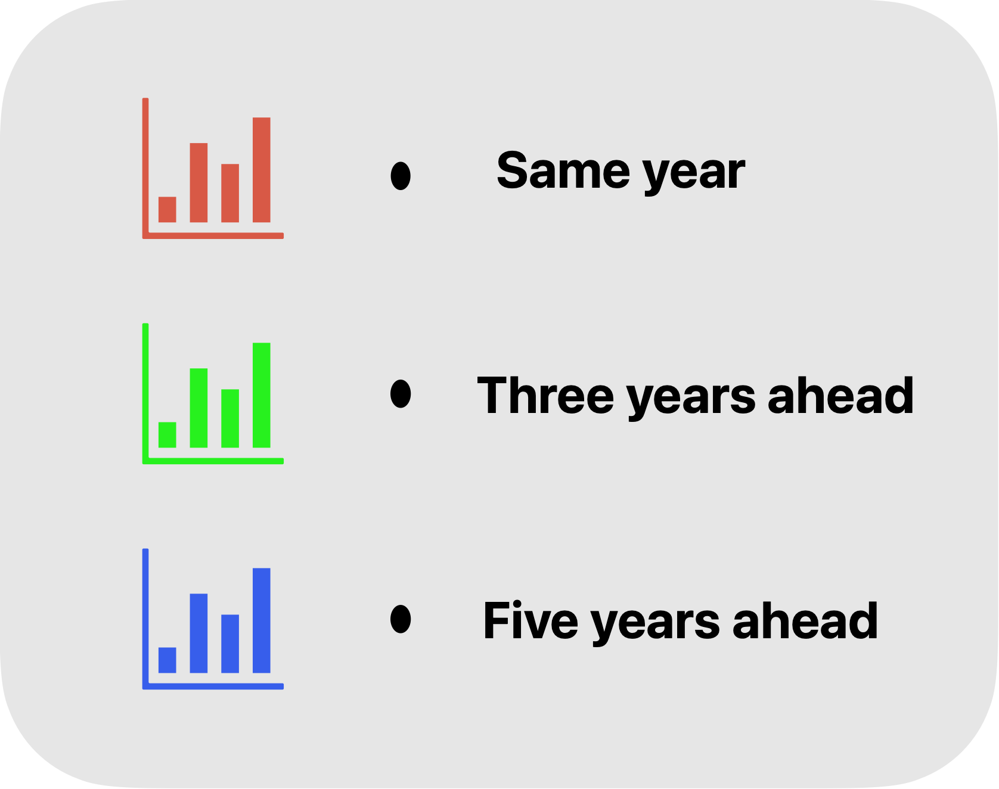
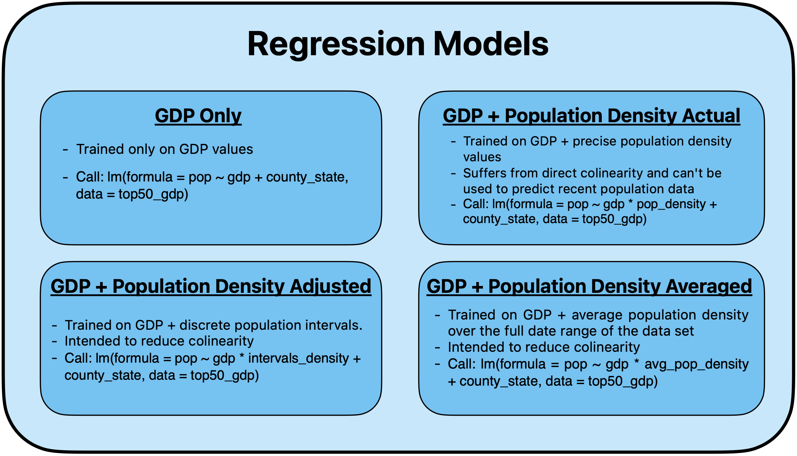
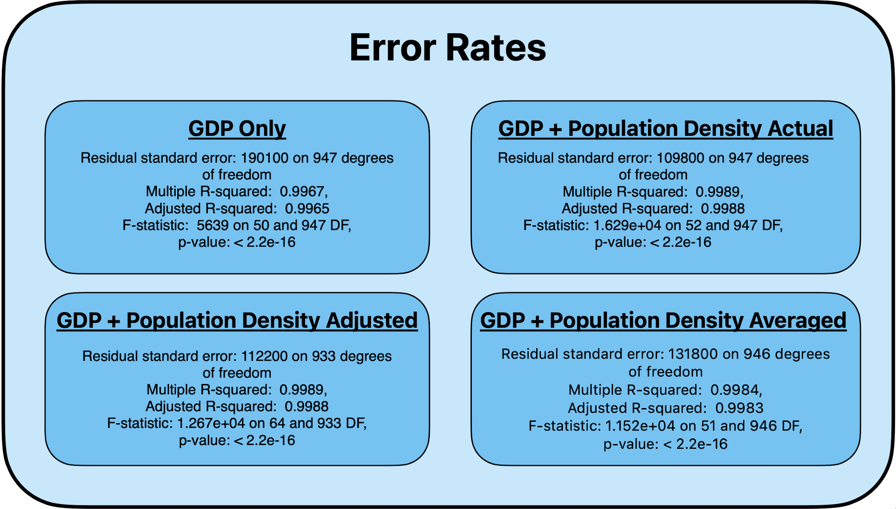

# Introduction
 
How do the economics of a region affect its overall population growth? This was the question I had in mind when approaching this project. I was inspired to explore this relationship through my time spent living in San Francisco and Detroit, two very distinct cities with distinct economic histories. The first is well known for its proximity to the booming tech Mecha of Silicon Valley and it's notoriously limited housing and compact geography. The other well known for the hardships resulting from the collapse of the local Automotive economy, and the subsequent decline in population. I wanted to see if these types of narratives are reflected in the data, and explore what types of relationships exist between economic growth and population growth. 

In this study I'll be taking a look at gdp and population data from 2000-2020. I hope to find a significant relationship between how much a region's economy grows and how much its population grows. 


## Overview:

This study tracks the gdp and population change of various core-based statistical 
areas (cbsa) as defined by the United States Census Bureau over a twenty year period from 
2000-2020. All population data was gather from the United States Census Bureau
and all GDP data was gathered from The Bureau of Economic Analysis.
<br></br>

#### Hypothesis
My initial hypothesis was as follows: as the GDP of a region increases, it's 
appeal as a place to live also increases, in turn causing the population to 
increase due to an influx of new residents. Conversely, it may also be true that if
a region experiences significant changes in population for reasons not directly related to economic growth, then that change will impact the economy. These are the types of relationships I hoped to explore when approaching this project. 
<br></br>
  
#### Sources

GDP data: 

* https://www.bea.gov/
* https://www.bea.gov/data/gdp/gdp-county-metro-and-other-areas 
* https://apps.bea.gov/regional/zip/SASUMMARY.zip 

Population and Land Mass data:

* https://www.census.gov/library/publications/2012/dec/c2010sr-01.html 
* https://www.census.gov/data/datasets/time-series/demo/popest/intercensal-2010-2020-metro.html 
* https://www.census.gov/geographies/reference-files/time-series/geo/gazetteer-files.html 
<br></br>

#### Note on terminology, metrics and ommissions
Throughout the study I will use the term CBSA and "region" interchangeably. I will also often refer to the primary Metropolitan area of a CBSA when discussing the entire region. For instance, I use "New York" and "The Greater New York Metropolitan Area" interchangeably. CBSAs are used by the Census Bureau to consolidate large population nuclei and their surrounding communities. This felt like the most appropriate unit of measurement to use since it would encompass small changes in population that occur locally and while also giving a broad overview of a region's overall GDP.

In order to simplify my examination of population change, I have also chosen to ignore birth rates and death rates. This seemed justifiable since the majority of states have fertility rates within 10 births per 1000 women and death rates that are equally similar [@BirthRates]. In a perfect world I would have population change adjusted for births and deaths but the process would have been messy given the discrepancy in how different data sources are organized. 

I have also chosen to look at a region's economic growth in the broadest sense, using GDP as the only metric. It is rather crude and may not paint the clearest picture of a region's economic reality, but for the purposes of this study it is sufficient. 
<br></br>

## Setting up my environment
```{r installing packages, message=FALSE, warning=FALSE}
library(tidyverse)
library(dplyr)
library(tidyr)
library(DBI)
library(RMySQL)
library(ggforce)
library(scales)
library(rmdformats)
library(purrr)
library(broom)
library(knitr)
library(MASS)
library(magrittr)
library(kableExtra)

```
```{r loading dataset, message=FALSE, warning=FALSE}
load("data6-6.RData")
```


## Population Trends:

First, let's take a look at some general population trends. The overall population of the United States has continued to rise since before the turn of the millenia. At first glance the population growth seems to be more or less consistent year over year. 
```{r}

us_pop$population <- as.numeric(us_pop$population)

us_pop$difference <- us_pop$population - lag(us_pop$population, n =1)

ggplot( data = us_pop, aes(x = year, y = population)) +
  geom_point(aes(alpha = difference), size = 3) + 
  geom_line(color = "blue") +
  scale_y_continuous(limits = c(280000000, NA), labels = comma) + 
  scale_x_continuous(breaks = seq(2000, 2020, by = 2)) + 
  theme_minimal() +
  theme(legend.position = "none") +
  labs(title = "US Population")
```

But taking a closer look at the data we can see there is a clear decline in growth rates, both on a national level and for regions with populations about 100k. 
```{r calculating national population rates}

average_pop_growth_rates_over100k <- filter(new_over100k, !is.na(pop_percentage_difference)) %>% group_by(year) %>% summarise(mean = mean(pop_percentage_difference), n = n())

average_pop_growth_rates <- filter(gdp_pop_land_mass2, !is.na(pop_percentage_difference)) %>% group_by(year) %>% summarise(mean = mean(pop_percentage_difference), n = n())

average_pop_growth_rates$over100k <- average_pop_growth_rates_over100k$mean

average_pop_growth_rates <- dplyr::select(average_pop_growth_rates, year, mean, over100k)

ggplot(data = average_pop_growth_rates, aes(x = year)) + 
  geom_line(aes(y = mean, color = "National Average")) +
  geom_line(aes(y = over100k, color = "Regions with Population \n over 100k")) +
  scale_x_continuous(breaks = seq(2000, 2020, by = 2)) +
  scale_y_continuous(labels = percent, breaks = seq(0, .018, by = .002)) +
  scale_color_manual(name = "", breaks = c("National Average", "Regions with Population \n over 100k"), 
                     values=c("National Average"="deepskyblue", "Regions with Population \n over 100k"="orchid")) +
 theme(legend.title=element_text(size=10), legend.text=element_text(size=8), legend.position = "bottom") +
  labs(title = "Average Annual Population Growth Rates") 
  

average_pop_growth_rates$mean <- percent(average_pop_growth_rates$mean, accuracy = .001)
average_pop_growth_rates$over100k <- percent(average_pop_growth_rates$over100k, accuracy = .001)

average_pop_growth_rates %>% kable(caption = "<center><strong>Average Annual Population Growth Rates</strong></center>", col.names = c("Year", "National Average", "Regions with Population over 100k")) %>% kable_styling()

```


These declining population growth rates are somewhat reflected in an interesting trend found among the most populous US cities. Many have seen stagnated growth. Since 2015 New York, Los Angeles, and Chicago have all seen decline in not just growth rate but actual population levels. On the other hand, less populated regions, such as Austin, TX and Houston, TX, have seen explosive population growth. Austin in particular saw its population nearly double over a twenty year period. 


```{r create plots for overall population, out.width="90%"}
ggplot(data = filter(big_city, pop > 8000000), aes(x = year)) + 
  geom_line(aes( y = pop/1000), linewidth = .8, color = "blue") + 
  facet_wrap_paginate(~county_state, ncol = 2, nrow = 2, page = 1, scales = "free_y")  + 
  scale_y_continuous( limits = c(0, NA), expand = expansion(mult =  c(.05, .2))) + scale_x_continuous(breaks = seq(2000, 2020, by = 2)) + 
  labs(title = "Overall Population For Most Populous Metropolitan Areas", subtitle="Stagnated Growth") + ylab("population (thousands of people)") + theme_bw()

ggplot(filter(big_city, cbsa == 19100 | cbsa == 12420 | cbsa == 26420), aes(x = year)) + 
  geom_line(aes( y = pop/1000), linewidth = .8, color = "blue") + 
  facet_wrap_paginate(~county_state, nrow=2, ncol =2) +
  scale_y_continuous(limits = c(0, NA), expand = expansion(mult =  c(.05, .2))) + 
  scale_x_continuous(breaks = seq(2000, 2020, by = 2)) + 
  labs(title = "Overall Population For Top 10 Most Populous Metropolitan Areas") + ylab("population (thousands of people)") + theme_bw()

ggplot(data = big_city, aes(x = year)) + geom_line( data = big_city, aes( y = pop/1000), linewidth = .8, color = "blue") + 
  facet_wrap_paginate(~county_state, ncol = 2, nrow = 2, page = 3, scales = "free_y")  + 
  scale_y_continuous(limits = c(0, NA), expand = expansion(mult =  c(.05, .2))) + scale_x_continuous(breaks = seq(2000, 2020, by = 2)) + 
  labs(title = "Overall Population For Top 10 Most Populous Metropolitan Areas") + ylab("population (thousands of people)") + theme_bw()

```


# Relationship Between Population and GDP

## Introduction

First, let's take a direct look at the relationship between gdp and population. Below is a scatter plot with gdp on the x-axis and population on the y-axis. Each color represents a different CBSA. 

```{r}
ggplot(gdp_pop_land_mass, aes(x = gdp/1000, y = pop/1000)) +
  geom_point(aes(color = county_state)) +
  theme_bw() +
  theme(legend.position = "none") +
  labs(title = "GDP vs Population", x = "GDP (thousands of dollars)", y = "Population (thousands of people)")
```


As you can see there is a general correlation between the size of a regions gdp and its overall population. However this does little in terms of demonstrating that the more gdp grows the more population grows. In fact for the three largest regions, namely New York, Los Angeles and Chicago, there seems to be little correlation between gdp growth and population. In fact, despite having gdps which have nearly doubled since 2000, these regions have seen relatively minor population growth, and in some instances population has actually shrank year over year. We will explore potential mitigating factors that may hamper population growth later on. 


## Examining growth rates
To further explore the correlation between economic growth and population, below is a graph which plots percentage gdp growth on the x-axis, and percentage population growth on the y-axis. Each data point represents the sum of growth rates for 20 year period considered in this study. For example, if City Z had a gdp growth rate of 2% year over year anda population growth rate of 1% year over year, its data point would be plotted at x=40%, y = 20%. The expansion of data points into the upper right corner of Quadrant I indicates that as percentage gdp growth increases, percentage population growth is also likely to increase. 

```{r message=FALSE, warning=FALSE, out.width="90%"}
sumgdpdiff <- aggregate(cbind(gdp_pop_final$pop_percentage_difference, gdp_pop_final$gdp_percentage_difference), list(gdp_pop_final$cbsa, gdp_pop_final$county_state), sum)
colnames(sumgdpdiff) <- c("cbsa", "county_state", "pop_change", "gdp_change")                        


ggplot(data = sumgdpdiff, aes(x = gdp_change, y = pop_change)) + geom_point(aes(color = county_state))  + 
  scale_y_continuous(expand = c(.01,.01), labels = percent) + 
  scale_x_continuous(expand = c(.01,.01), labels = percent) + 
  geom_hline(yintercept = 0, linetype = "dashed") + geom_vline(xintercept = 0, linetype = "dashed") +
  labs(title= "20 Year Aggregated GDP and Population Growth Rates", x = "gdp", y = "population", label = percent) + 
  theme(legend.position = "none", panel.background = element_rect(fill="white"), panel.grid= element_line(colour="gray89"))

```


Along the same vein, below is a graph of the population growth rates for give a given gdp over one year, three year, and five year periods, represented by red, green, and blue dots respectively. The idea behind the graph is get a picture of how gdp growth in a particular year relates to population growth in future years. The significance of the graph is found primarily in the increase separation of the one year, three year, and five year values as gdp growth increases. As shown in the graph, as gdp growth increases in a given year, the likelihood that population will also increase at a higher rate increases.

```{r percentage growth rates over 1.3.5, message=FALSE, warning=FALSE, out.width="90%"}
cols <- c("one year"="red", "three years"="green", "five years"="blue")
ggplot(data = over100k, aes(x = gdp_percentage_difference)) + 
  geom_point(aes(y = pop_percentage_difference, colour="one year", group = 1), alpha = .9, size = .2) + 
  geom_point(aes(y = pop_perc_sum3, colour = "three years", group = 1),  alpha = .7, size = .2) + 
  geom_point(aes(y = pop_perc_sum5, colour = "five years", group = 1), alpha = .2, size = .2) + 
  scale_x_continuous(limits = c(-.2, .4) , expand = c(0,0),  labels= percent) + scale_y_continuous(limits = c(-.3, .3) , expand = c(0,0),  labels= percent) + 
  geom_hline(yintercept = 0, linetype = "dashed") + geom_vline(xintercept = 0, linetype = "dashed") + 
  labs(title= "Percentage GDP and Population Growth") + theme_bw() +
  scale_colour_manual(name="Time Frames",values=cols)


```

By looking even closer at the data, we notice a striking trend for regions whose population increased by more than 10% over a five year period. Of those regions, 81% (197 out of 244) had gdps which grew by at least 5%. Of those regions whose population increased by more than 15%, 100% had gpds which grew by at least 5%. In CBSAs with over 100000 people, there was no instance where a population growth of at least 15% over a five year period did not correspond with an initial gdp growth of at least 5%. That is to say, no region with a GDP growth of less than 5% went on to experience a population boom of 15% or more. This is very strong evidence that there is a connection between the population growth of a region and how well its economy is performing. At the least it shows that economic and population growth go hand in hand, with each one benefiting from the other. 

```{r message=FALSE, warning=FALSE, out.width="90%"}
ggplot(data = over100k, aes(x = gdp_percentage_difference)) + 
  geom_point(aes(y = pop_percentage_difference, colour="one year", group = 1), alpha = .9, size = .2) + 
  geom_point(aes(y = pop_perc_sum3, colour = "three years", group = 1),  alpha = .7, size = .2) + 
  geom_point(aes(y = pop_perc_sum5, colour = "five years", group = 1), alpha = .4, size = .2) + 
  scale_x_continuous(limits = c(-.02, .2) , expand = c(0,0),  labels= percent) + scale_y_continuous(limits = c(-.02, .2) , expand = c(0,0),  labels= percent) + 
  geom_hline(yintercept = 0, linetype = "dashed") + geom_vline(xintercept = 0, linetype = "dashed") + 
  labs(title= "Percentage GDP and Population Growth", y = "population growth", x = "gdp growth") + theme_bw() +
  scale_colour_manual(name="Time Frames",values=cols) +
  annotate("text", x = .12, y = .18, label = "All data points for population growth above 15% \n correspond to an initial gdp growth of at least 5%", size = 3) +
  annotate("text", x = .11, y = .13, label = "80% of regions with population growth above 10% \n had an initial gdp growth of 5% ", size = 3) +
  annotate("rect", xmin = -.02, xmax = .2, ymin = .1, ymax = .2, alpha = .1, fill = "steelblue2") +
  annotate("rect", xmin = .05, xmax = .2, ymin = .15 , ymax = .2, alpha = .2, fill = "darkslategray2") +
  annotate("segment", x = .05, xend = .2, y = .15, colour = "blue4", linetype = "dotted") +
  annotate("segment", x = .05, y = .15, yend = .2, colour = "blue4", linetype = "dotted") +
  annotate("segment", x = -.02, xend = .2, y = .1, colour = "blue4", linetype = "dotted") +
  annotate("segment", x = -.02, y = .1, yend = .2, colour = "blue4", linetype = "dotted")
 

```


Next, I explored the relationship between a region's economic growth and its population growth rates for the proceeding years. My hypothesis was as follows: regions with higher relative gdp growth rates (above 5%) are more likely to have population growth rates rise over a ten year period. 

In order to further examine the data, I grouped gdp growth rates into discrete ranges and compared population growth rates at 1, 3, and 5 year intervals for each range. I expected the population growth rates for higher gdp intervals to be significantly higher at 3 and 5 years. This would imply that those regions with growing economies are more likely to have accelerating population growth in the future. 

In the graph below, plots are divided by gdp interval, with each color representing a different time interval at which population growth rates were measured.

```{r, echo=FALSE, out.width="50%", fig.cap="Legend", fig.align='center'}

```


```{r time to show it with math, message=FALSE, warning=FALSE, out.width="90%"}


# Filtering CBSAs for regions over 100k population

new_over100k <- new_over100k_copy

# cleaning new_100k
new_over100k$intervals_pop <-NULL
new_over100k$intervals_pop_lead2 <-NULL
new_over100k$intervals_pop_lead3 <- NULL
new_over100k$intervals_pop_lead4 <-NULL
new_over100k$intervals_pop_lead5 <- NULL

new_over100k <- filter(new_over100k, !is.na(intervals_gdp))


# setting up gdp intervals


breaks <- seq(-.3, .45, by = (.45 + .3)/10)

breaks2 <- c(-.3, -.15, 0, 0.075, .15, .3, .45)

new_over100k$intervals_gdp <- cut(new_over100k$gdp_percentage_difference, breaks2, right = TRUE, include.lowest = TRUE)

# pop percentage difference at different gdp intervals
ggplot(filter(new_over100k, cbsa != 35380)) + 
  geom_histogram(binwidth = .001, aes(x = pop_percentage_difference), fill = "red", alpha = 1) + 
  geom_histogram(binwidth = .001, aes(x = pop_percentage_difference_lead3), fill = "green", alpha = .6) +
  geom_histogram(binwidth = .001, aes(x = pop_percentage_difference_lead5), fill = "blue", alpha = .6) +
  facet_wrap_paginate(~intervals_gdp, page= 1, ncol = 2, nrow = 2, scales = "free_y") +
  labs(title = "pop percentage") +
  scale_x_continuous(limits = c(-.05, .05))


ggplot(filter(new_over100k, cbsa != 35380)) + 
  geom_histogram(binwidth = .001, aes(x = pop_percentage_difference), fill = "red", alpha = 1) + 
  geom_histogram(binwidth = .001, aes(x = pop_percentage_difference_lead3), fill = "green", alpha = .6) +
  geom_histogram(binwidth = .001, aes(x = pop_percentage_difference_lead5), fill = "blue", alpha = .6) +
  facet_wrap_paginate(~intervals_gdp, page= 2, ncol = 2, nrow = 2, scales = "free_y") +
  labs(title = "pop percentage") +
  scale_x_continuous(limits = c(-.05, .05))

# ggplot(filter(new_over100k, cbsa != 35380)) + 
#   geom_histogram(binwidth = .001, aes(x = pop_percentage_difference), fill = "red", alpha = 1) + 
#   geom_histogram(binwidth = .001, aes(x = pop_percentage_difference_lead3), fill = "green", alpha = .6) +
#   geom_histogram(binwidth = .001, aes(x = pop_percentage_difference_lead5), fill = "blue", alpha = .6) +
#   facet_wrap_paginate(~intervals_gdp, page= 3, ncol = 1, nrow = 2, scales = "free_y") +
#   labs(title = "pop percentage") +
#   scale_x_continuous(limits = c(-.05, .05))
# 
# ggplot(filter(new_over100k, cbsa != 35380)) + 
#   geom_histogram(binwidth = .001, aes(x = pop_percentage_difference), fill = "red", alpha = 1) + 
#   geom_histogram(binwidth = .001, aes(x = pop_percentage_difference_lead3), fill = "green", alpha = .6) +
#   geom_histogram(binwidth = .001, aes(x = pop_percentage_difference_lead5), fill = "blue", alpha = .4) +
#   scale_x_continuous(limits = c(-.025, .06))


```

However, taking a look at the data, it became clear that higher economic growth was not a clear indicator that population rates would increase in the long term. Even in the highest bracket of gdp growth

```{r mathing sum of pop rates for each gdp interval, out.width="90%"}
# stable new_over100k
new_over100k <- new_over100k_copy

# cleaning new_100k
new_over100k$intervals_pop <-NULL
new_over100k$intervals_pop_lead2 <-NULL
new_over100k$intervals_pop_lead3 <- NULL
new_over100k$intervals_pop_lead4 <-NULL
new_over100k$intervals_pop_lead5 <- NULL

new_over100k <- filter(new_over100k, !is.na(intervals_gdp))
new_over100k[is.na(new_over100k)] <- 0

# summing rates at different gdp intervals
sum_totals <- 
  new_over100k %>%
    group_by(intervals_gdp) %>%
    summarise(sum_pop_rate = sum(pop_percentage_difference), 
              sum_pop_rate_year3 = sum(pop_percentage_difference_lead3),
              sum_pop_rate_year5 = sum(pop_percentage_difference_lead5))

sum_totals$sum_pop_rate <- percent(sum_totals$sum_pop_rate, accuracy = .1)
sum_totals$sum_pop_rate_year3 <- percent(sum_totals$sum_pop_rate_year3, accuracy = .1)
sum_totals$sum_pop_rate_year5 <- percent(sum_totals$sum_pop_rate_year5, accuracy = .1)

kable(sum_totals, caption = "<strong><center>Total Percentage Population Growth at Various GDP Intervals</center></strong>", col.names = c("GDP Interval", "Total Pop. Growth", "Total Pop. Growth: 3 years", "Total Pop. Growth: 5 years")) %>% kable_styling(bootstrap_options = "bordered")

results <- 
  filter(new_over100k, year < 2017, !is.na(pop_percentage_difference), 
  !is.na(pop_percentage_difference_lead3), !is.na(pop_percentage_difference_lead5)) %>%            
  group_by(intervals_gdp) %>% 
  summarise(mean = mean(pop_percentage_difference), mean_lead3 = mean(pop_percentage_difference_lead3),
  mean_lead5 = mean(pop_percentage_difference_lead5))


results <- as.data.frame(results)

results$mean <- percent(results$mean, accuracy = .0001)
results$mean_lead3 <- percent(results$mean_lead3, accuracy = .0001)
results$mean_lead5 <- percent(results$mean_lead5, accuracy = .0001)


kable(filter(results, !is.na(intervals_gdp)), col.names = c("GDP Growth Rate Intervals", "One Year Average", "Three Year Average", "Five Year Average"), align = "crrr") %>% kable_styling(bootstrap_options = "bordered")

```


 At almost all intervals, population growth rates decreased. In many ways this makes sense. It is well known that population growth rates in the United States have been mostly declining for the past 25 years @PopDecline. 


```{r, out.width="90%"}
# Calculating national average birth rates

average_pop_growth_rates_over100k <- filter(new_over100k, !is.na(pop_percentage_difference)) %>% group_by(year) %>% summarise(mean = mean(pop_percentage_difference), n = n())

average_pop_growth_rates <- filter(gdp_pop_land_mass2, !is.na(pop_percentage_difference)) %>% group_by(year) %>% summarise(mean = mean(pop_percentage_difference), n = n())

average_pop_growth_rates$over100k <- average_pop_growth_rates_over100k$mean

average_pop_growth_rates <- dplyr::select(average_pop_growth_rates, year, mean, over100k)

average_pop_growth_rates_copy <- average_pop_growth_rates
  

average_pop_growth_rates$mean <- percent(average_pop_growth_rates$mean, accuracy = .001)
average_pop_growth_rates$over100k <- percent(average_pop_growth_rates$over100k, accuracy = .001)

average_pop_growth_rates %>% kable(caption = "<center><strong>Average Annual Population Growth Rates</strong></center>", col.names = c("Year", "National Average", "Regions with Population over 100k")) %>% kable_styling()

ggplot(data = average_pop_growth_rates_copy, aes(x = year)) + 
  geom_line(aes(y = mean, color = "National Average")) +
  geom_line(aes(y = over100k, color = "Regions with Population \n over 100k")) +
  scale_x_continuous(breaks = seq(2000, 2020, by = 2)) +
  scale_y_continuous(labels = percent, breaks = seq(0, .018, by = .002)) +
  scale_color_manual(name = "", breaks = c("National Average", "Regions with Population \n over 100k"), 
                     values=c("National Average"="deepskyblue", "Regions with Population \n over 100k"="orchid")) +
 theme(legend.title=element_text(size=10), legend.text=element_text(size=8), legend.position = "bottom") +
  labs(title = "Average Annual Population Growth Rates") 
```


Still, it was surprising that, generally, more economic growth does not necessarily equate to accelerating population growth. It certainly isn't enough to outpace national trends in declining population growth rates.


# Modeling the data

## Linear regression model

Next, I wanted to see if I could create a model that would accurately predict population values for the past five years. The data set I compiled only had population data from 2000 to 2020, and GDP data from 2001 to 2020. I thought it would be interesting if I could test a model on my current data set and compare its predictions with recent population data. 


The first thing I did was create a basic linear regression model trained on the entire data set with population as a dependent variable and GDP as the independent variable. As you can see, overall, the regression line fits the data fairly well. There is a clear correlation between GDP size and population size. 
```{r gdp vs pop percentages}
ggplot(data = gdp_pop_with_diff, aes(x = gdp/1000, y = pop/1000)) + geom_point(aes(color = county_state)) + theme(legend.position = "none") + labs(title="GDP vs Population", subtitle = "all included cbsas", x="gdp (millions of dollars)", y = "population (thousands of people)", labels = comma)

ggplot(data = gdp_pop_with_diff, aes(x = gdp/1000, y = pop/1000)) + geom_point(aes(color = county_state)) + theme(legend.position = "none") + labs(title="GDP vs Population", subtitle = "all included cbsas", x="gdp (millions of dollars)", y = "population (thousands of people)", labels = comma) + geom_smooth(method = lm, formula = y ~ x)

```

 The summary of the model is as follows:

```{r}

pop_gdp_model <- lm(formula= pop ~ gdp, data = gdp_pop_land_mass)
summary(pop_gdp_model)


```
And here is a plot of the model's predictions vs actual values, with predictions on y-axis and actual on x-axis

```{r calculating MSE}

gdp_pop_rmse_train <- gdp_pop_land_mass %>%
  mutate(prediction = predict(pop_gdp_model))

ggplot(gdp_pop_rmse_train, aes(x = pop, y = prediction)) + 
  geom_point(shape = 1, color = "black", fill = "white", size = 2) + 
  theme_bw() + 
  labs(title="Actual vs. Predicted", x = "actual",  y = "predicted")
```
## Error rate of linear model
An R^2 value of .9362 indicates a fairly strong correlation between population and GDP. At the same time, when focusing on individual regions, there are several clear examples where the regression line does not fit the data well, especially among the regions with the highest GDP. Ultimately, the question I sought to explore when starting this project was whether economic growth in a particular region is compelling enough to attract newcomers willing to move from other regions, and whether that relationship could be measured. When testing the accuracy of the linear model against data from the top 50 gdp regions, we see that the RMSE is quite high. Nearly 5x higher than the RMSE when run on the entire data set. This implies a significant limiting factor affecting the strength of the relationship between gdp and population as gdp increases. We will explore some potential explanations for this effect in the next section. 


```{r calculating RMSE for top 50}


top50_mse <- inner_join(gdp_pop_rmse_train, top50_gdp, by = c("cbsa", "year"), keep = FALSE )


top50_mse <- top50_mse %>%
  rename_at(
    vars(ends_with(".x")),
    ~str_replace(., "\\..$","")
  ) %>% 
  select_at(
    vars(-ends_with(".y"))
  )

mse <- gdp_pop_rmse_train %>%
  mutate(error = prediction - pop , sq_error = error^ 2) %>%
  summarise(mse = mean(sq_error))


rmse <- sqrt(mse)

kable(rmse, col.names = "RMSE", caption = "<center>Full Data Set</center>") %>% 
  kable_styling(bootstrap_options = "bordered")

top50_mse <- top50_mse %>%
  mutate(error = prediction - pop , sq_error = error^ 2) %>%
  summarise(mse = mean(sq_error))

top50_mse <- sqrt(top50_mse)

kable(top50_mse, col.names = "RMSE", caption = "<center>Top 50 GDPs</center>", align = "r") %>% kable_styling(bootstrap_options = "bordered")
```

## Exploring Additional Variables

It's clear from the model that GDP growth alone is not sufficient to predict population growth, especially for regions with the highest GDPs. In order to create a more accurate model, we'll have to incorporate some new variables. One of the most striking aspects of the data when comparing GDP and population is the minimal population growth in the most economically productive regions of the United States, such as The New York Metropolitan Area, San Francisco, Chicago, and Los Angeles. While these regions top the charts in terms of GDP size, they also top the charts in another metric: population density. 

If we take a look at a ranking of the top 10 most productive and top 10 most densely populated regions, we see that the results are very similar. 
These are also the regions that have among the lowest ratio of population to GDP growth. In other words, these regions saw the lowest percentage population growth relative to gdp growth. On the other hand, a region such as Austin, Texas, which had an average population density around 400 people/square mile, saw nearly 10x the relative population to gdp growth as Chicago, Illinois, whose population density averaged around 1400 people/square mile.  

```{r}

gdp_ranking <- aggregate(cbind(gdp, pop) ~ (cbsa + county_state), data = top50_gdp, mean)
colnames(gdp_ranking) <- c("cbsa", "county_state", "avg_gdp", "avg_pop") 

gdp_ranking <- gdp_ranking %>% arrange(desc(avg_gdp)) %>% head( 10)

kable(gdp_ranking, caption = "<center>GDP Ranking</center>", 
      col.names = c("CBSA", "Metropolitan Area", "Average GDP", "Average Population"), align = "llcc") %>% kable_styling(bootstrap_options = "bordered")


density_ranking <- aggregate( cbind(gdp, pop, pop_density) ~ (cbsa + county_state), data = top50_gdp, mean)
colnames(density_ranking) <- c("cbsa", "county_state", "avg_gdp", "avg_pop", "avg_pop_density") 
density_ranking <- density_ranking %>% arrange(desc(avg_pop_density)) %>% head(30)

kable(dplyr::select(density_ranking, cbsa, county_state, avg_pop_density), caption = "<center>Population Density Ranking</center>", col.names = c("CBSA", "Metropolitan Area", "Population Density"), align = "llccc") %>% kable_styling(bootstrap_options = "bordered")

```


 

```{r}

sum_totals <- aggregate(cbind(gdp_percentage_difference, pop_percentage_difference) ~ (cbsa + county_state), data = top50_gdp, sum)

colnames(sum_totals) <- c("cbsa", "county_state", "sum_gdp", "sum_pop")

sum_totals$ratio <- (sum_totals$sum_pop / sum_totals$sum_gdp)

sum_totals$sum_pop <- percent(sum_totals$sum_pop, accuracy = .01)
sum_totals$sum_gdp <- percent(sum_totals$sum_gdp, accuracy = .01)

kable(arrange(sum_totals, ratio), caption = "Population over GDP ratios", col.names = c("CBSA", "County", "Total GDP Growth", "Total Population Growth", "Ratio")) %>% 
  kable_styling(bootstrap_options = "bordered")

# 
# sum_totals <- aggregate(cbind(gdp_percentage_difference, pop_percentage_difference) ~ (cbsa + county_state), data = top50_gdp, mean)
# 
# 
# sum_totals
# 
# colnames(sum_totals) <- c("cbsa", "county_state", "mean_gdp", "mean_pop")
# 
# sum_totals$ratio <- (sum_totals$mean_pop / sum_totals$mean_gdp)
# 
# kable(arrange(sum_totals, ratio), caption = "Population over GDP ratios", col.names = c("CBSA", "County", "Average gdp rate", "Average pop rate", "Ratio")) %>% 
#   kable_styling(bootstrap_options = "bordered")

```


It seems population density acts as a natural obstacle to population growth. At face value, it is easy to see why that would be the case. More people in an area leads to higher demand for nearly all goods and services, including housing. Higher demand leads to higher prices. It is no coincidence that many of the regions with the highest population densities also have the highest cost of living [@CostRankings]. 

Note: keep in mind that population density values in this study (and all values for that matter) are for the greater metropolitan areas of major cities. Many individual cities have population densities much higher than 3000 people/sq mi.

# Incorporating Population Density into Regression Models

In order to further explore this relationship, I created a few additional models that attempt to incorporate population density as a second independent variable. However, this presented some problems with collinearity since population density is obviously a function of population itself. When I created a model using population density directly, the model was able to make extremely accurate predictions, especially among those regions with consistent gdp and population growth. Interestingly though, it did perform worse for regions that experienced relatively higher percentage population change year over year, such as San Francisco.




```{r message=FALSE, warning=FALSE, out.width="90%"}
ggplot(filter(top50_gdp, cbsa == 12420), aes(x = gdp, y = pop, group = county_state)) +
  geom_point(size = 1.5) +
  geom_line(aes(y = predicted), color = "green", size = 1.5, alpha = .6) +
  geom_line(aes(y = predicted_density_adjusted), color = "red", size = 1.5, alpha = .6) +
  geom_line(aes(y = predicted_density_averaged), color = "orchid", size = 1.5, alpha = .6) +
  geom_line(aes(y = predicted_density_direct, color="GDP and Population \n Density Actual"), size = 2, alpha = .6) +
  scale_color_manual(name="Regression Model", 
                     breaks=c("GDP and Population \n Density Actual"),
                     values=c("GDP and Population \n Density Actual"="blue")) +
  labs(title="Example of The Accuracy of the 'Population Density \n Actual Model' Compared to other Models", subtitle="Austin, TX") + theme_bw()

ggplot(filter(top50_gdp, cbsa == 41860 ), aes(x = gdp, y = pop, group = county_state)) +
  geom_point(size = 1.5) +
  geom_line(aes(y = predicted), color = "green", size = 1.5, alpha = .6) +
  geom_line(aes(y = predicted_density_adjusted), color = "red", size = 1.5, alpha = .6) +
  geom_line(aes(y = predicted_density_averaged), color = "orchid", size = 1.5, alpha = .6) +
  geom_line(aes(y = predicted_density_direct, color="GDP and Population \n Density Actual"), size = 2, alpha = .6) +
  scale_color_manual(name="Regression Model", 
                     breaks=c("GDP and Population \n Density Actual"),
                     values=c("GDP and Population \n Density Actual"="blue")) +
  labs(title="Example of The Accuracy of the 'Population Density \n Actual Model' Compared to other Models", subtitle = "San Francisco, CA", x = "GDP", y = "Population") + theme_bw()

```

However, despite the accuracy of the population density actual model, I couldn't use it to predict population levels from the last five years since it requires an unknown variable (population density) to make predictions. In order to resolve this dilemma, I took two approaches:

The first was to separate population density values into discrete intervals, then bin each GDP/population data point into the appropriate interval. This way population density would still have an impact on the regression model but would not have extremely high correlation with the outcome, as small changes to population would most often not affect which population density "bin" a given region was in. This reduced the strong colinearity between population and population density growth rates. In this model I also added an artificial cap to population density at 1000 people/sqmile. Any region with a population density above this level would default to a value of 1000. This was to more accurately reflect population density's impact on the outcome,  which seems have to a natural cap around 1000 people/sqmile. 


The second approach was to simply average population density across the 20 year time frame used in this study. This also removed the strong correlation between changes in population density and changes in population itself while providing a fairly accurate value for a region's population density. 

```{r}

top50_gdp_copy <- top50_gdp

top50_gdp <- filter(top50, year < 2021)

top50_gdp <- top50_gdp %>%
  rename_at(
    vars(ends_with(".x")),
    ~str_replace(., "\\..$","")
  ) %>% 
  select_at(
    vars(-ends_with(".y"))
  )


# Creating pop density intervals adjusted
top50_gdp$density_adjusted <- ifelse(top50_gdp$pop_density > 1000, 1000, top50_gdp$pop_density) 


breaks <- seq(min(top50_gdp$density_adjusted), max(top50_gdp$density_adjusted), by = (max(top50_gdp$density_adjusted)-min(top50_gdp$density_adjusted))/8)

top50_gdp$intervals_density <- cut(top50_gdp$density_adjusted, 
                                   breaks, right = TRUE, include.lowest = TRUE)


# Creating pop density intervals
breaks <- seq(min(top50_gdp$pop_density), max(top50_gdp$pop_density), by = (max(top50_gdp$pop_density)-min(top50_gdp$pop_density))/12)

top50_gdp$intervals_density_2 <- cut(top50_gdp$pop_density, breaks, right = TRUE, include.lowest = TRUE)


#creating average pop density
avg_pop_density <- 
  top50_gdp %>%
  group_by(cbsa) %>%
  summarise(avg_pop_density = mean(pop_density))
  
top50_gdp <- inner_join(top50_gdp, avg_pop_density, by = c("cbsa"), keep = FALSE )

top50_gdp <- top50_gdp %>%
  rename_at(
    vars(ends_with(".x")),
    ~str_replace(., "\\..$","")
  ) %>% 
  select_at(
    vars(-ends_with(".y"))
  )

# create linear models
gdp_lm <- lm(formula = pop ~ gdp + county_state, top50_gdp)

gdp_lm_density_adjusted <- lm(formula = pop ~ gdp * intervals_density + county_state, top50_gdp)

gdp_lm_density_averaged <- lm(formula = pop ~ gdp * avg_pop_density + county_state, top50_gdp)

gdp_lm_density_interval <- lm(formula = pop ~ gdp * intervals_density_2 + county_state, top50_gdp)


# predict values using models
top50_gdp$predicted <- predict(gdp_lm)
top50_gdp$predicted_density_adjusted <- predict(gdp_lm_density_adjusted)
top50_gdp$predicted_density_averaged <- predict(gdp_lm_density_averaged)
top50_gdp$predicted_density_interval <- predict(gdp_lm_density_interval)


# summary(gdp_lm)
# summary(gdp_lm_density_adjusted)
# summary(gdp_lm_density_averaged)
# summary(gdp_lm_density_interval)
# summary(gdp_lm_density_direct)


```


## Comparing error rates of each model


```{r}

mse <- top50_gdp %>%
  mutate(error = predicted- pop , sq_error = error^2, 
         error_lm_adj = predicted_density_adjusted - pop, sq_error_2 = error_lm_adj^2,
         error_lm_avg = predicted_density_averaged - pop, sq_error_3 = error_lm_avg^2) %>%
  summarise(sum = sum(sq_error), sum_adj = sum(sq_error_2), sum_avg = sum(sq_error_3), .groups = "drop") %>%
  summarise(mean = mean(sum), mean_adj = mean(sum_adj), mean_avg = mean(sum_avg), .groups = "drop")

rmse <- sqrt(mse)

kable(rmse, caption = "<center>RMSE for each Model</center>", col.names = c("GDP Only Model", "GDP with Population Density Adjusted", "GDP with Population Density Averaged" )) %>% kable_styling(bootstrap_options = "bordered")

```


Of the three models, GDP with Population Density Adjusted, the model that incorporates buckets and an effective cap on the influence of population density, performed the best with an RMSE nearly 20000 people closer to actual than the model with averaged population density. This is in part to the unavoidable direct correlation between population density and population. Even when separating population density into discrete intervals there is unavoidable colinearity that occurs when a region's population density hovers near the boundaries between intervals. 

However, every model that incorporated population density made more accurate predictions than the model that used GDP as the only independent variable, especially among regions where population density was at its highest. 


## Graphical Representations of Regression Models
```{r, out.width="90%"}


ggplot(top50_gdp, aes(x = gdp, y = pop, color = county_state, group = county_state)) +
  geom_point() +
  geom_line(aes(y = predicted), color = "green") +
  geom_line(aes(y = predicted_density_adjusted), color = "red") +
  geom_line(aes(y = predicted_density_averaged), color = "orchid") +
  labs(y="population", x="gdp", title="Comparsion of Model Predictions") +
  theme_bw() +  theme(legend.position = "none") 

ggplot(top50_gdp, aes(x = gdp, y = pop, group = county_state )) +
  geom_point(size=.8) +
  geom_line(aes(y = predicted), color = "green") +
  geom_line(aes(y = predicted_density_adjusted), color = "red") +
  geom_line(aes(y = predicted_density_averaged), color = "orchid") +
  theme(legend.position = "none") +
  facet_wrap_paginate(~county_state, ncol = 2, nrow = 2, page = 1, scale = "free") + 
  labs(y="population", x="gdp") +
  theme_bw() +  theme(legend.position = "none") 

ggplot(top50_gdp, aes(x = gdp, y = pop, group = county_state )) +
  geom_point(size=.8) +
  geom_line(aes(y = predicted), color = "green") +
  geom_line(aes(y = predicted_density_adjusted), color = "red") +
  geom_line(aes(y = predicted_density_averaged), color = "orchid") +
  theme(legend.position = "none") +
  facet_wrap_paginate(~county_state, ncol = 2, nrow = 2, page = 2, scale = "free") + 
  labs(y="population", x="gdp") +
  theme_bw() +  theme(legend.position = "none") 

ggplot(top50_gdp, aes(x = gdp, y = pop, group = county_state )) +
  geom_point(size=.8) +
  geom_line(aes(y = predicted), color = "green") +
  geom_line(aes(y = predicted_density_adjusted), color = "red") +
  geom_line(aes(y = predicted_density_averaged), color = "orchid") +
  theme(legend.position = "none") +
  facet_wrap_paginate(~county_state, ncol = 2, nrow = 2, page = 3, scale = "free") + 
  labs(y="population", x="gdp") +
  theme_bw() +  theme(legend.position = "none") 

ggplot(top50_gdp, aes(x = gdp, y = pop, group = county_state )) +
  geom_point(size=.8) +
  geom_line(aes(y = predicted), color = "green") +
  geom_line(aes(y = predicted_density_adjusted), color = "red") +
  geom_line(aes(y = predicted_density_averaged), color = "orchid") +
  facet_wrap_paginate(~county_state, ncol = 2, nrow = 2, page = 4, scale = "free") + 
  labs(y="population", x="gdp") +
  theme_bw() +  theme(legend.position = "none") 

ggplot(top50_gdp, aes(x = gdp, y = pop, group = county_state )) +
  geom_point(size=.8) +
  geom_line(aes(y = predicted), color = "green") +
  geom_line(aes(y = predicted_density_adjusted), color = "red") +
  geom_line(aes(y = predicted_density_averaged), color = "orchid") +
  facet_wrap_paginate(~county_state, ncol = 2, nrow = 2, page = 5, scale = "free") + 
  labs(y="population", x="gdp") +
  theme_bw() +  theme(legend.position = "none") 

ggplot(top50_gdp, aes(x = gdp, y = pop, group = county_state )) +
  geom_point(size=.8) +
  geom_line(aes(y = predicted), color = "green") +
  geom_line(aes(y = predicted_density_adjusted), color = "red") +
  geom_line(aes(y = predicted_density_averaged), color = "orchid") +
  facet_wrap_paginate(~county_state, ncol = 2, nrow = 2, page = 6, scale = "free") + 
  labs(y="population", x="gdp") +
  theme_bw() +  theme(legend.position = "none") 

ggplot(top50_gdp, aes(x = gdp, y = pop, group = county_state )) +
  geom_point(size=.8) +
  geom_line(aes(y = predicted), color = "green") +
  geom_line(aes(y = predicted_density_adjusted), color = "red") +
  geom_line(aes(y = predicted_density_averaged), color = "orchid") +
  theme(legend.position = "none") +
  facet_wrap_paginate(~county_state, ncol = 2, nrow = 2, page = 7, scale = "free") + 
  labs(y="population", x="gdp") +
  theme_bw() +  theme(legend.position = "none") 

ggplot(top50_gdp, aes(x = gdp, y = pop, group = county_state )) +
  geom_point(size=.8) +
  geom_line(aes(y = predicted), color = "green") +
  geom_line(aes(y = predicted_density_adjusted), color = "red") +
  geom_line(aes(y = predicted_density_averaged), color = "orchid") +
  facet_wrap_paginate(~county_state, ncol = 2, nrow = 2, page = 8, scale = "free") +
  labs(y="population", x="gdp") +
  theme_bw() +  theme(legend.position = "none") 


```


# Predicting Most Recent Population Data

The final part of this study will be an attempt to predict current population values using only current GDP and values already present in the data set. The BEA has only released GDP data per county up to the year 2023, so we'll try to make predictions for population data for 2020-2023. I will be focusing solely on the top 50 highest average GDP CBSAs. 

```{r processing data set to include most recent GDP data, out.width="90%"}

# rebuilding top50 table from updated gdp table
max_gdp <- aggregate(gdp ~ (cbsa + county_state), data = gdp_pop_land_mass_2023, max)

max_gdp <- arrange(max_gdp, desc(gdp))


top50 <- head(max_gdp, 50)

top50_test <- inner_join(gdp_pop_land_mass_2023, top50, by = c("cbsa", "county_state"), keep=FALSE)

top50_test <- top50_test %>%
  rename_at(
    vars(ends_with(".x")),
    ~str_replace(., "\\..$","")
  ) %>% 
  select_at(
    vars(-ends_with(".y"))
  )


top50_final <- left_join(top50_test, top50_gdp, by = c("cbsa", "county_state", "year"), keep=FALSE) 

top50_final <- top50_final %>%
  rename_at(
    vars(ends_with(".x")),
    ~str_replace(., "\\..$","")
  ) %>% 
  select_at(
    vars(-ends_with(".y"))
  )


top50_final_copy <- top50_final

top50_final_copy <- top50_final_copy %>% fill(intervals_density)

top50_final_copy <- top50_final_copy %>% fill(avg_pop_density)


#join with final pop table
top50 <- left_join(top50_final_copy, pop_2024, by = c("cbsa", "year"), keep = FALSE)

top50$pop.x <- ifelse(is.na(top50$pop.x), top50$pop.y, top50$pop.x)

top50 <- top50 %>%
  rename_at(
    vars(ends_with(".x")),
    ~str_replace(., "\\..$","")
  ) %>% 
  select_at(
    vars(-ends_with(".y"))
  )

view(top50)

top50 <- top50 %>% group_by(cbsa, county_state, year) %>% filter(n() == 1)
```


## Predicting using new GDP values

Here are the results of attempting to predict current population values by the models trained on previous data. Green lines are for the model trained only on GDP, red lines are for the model trained on population density intervals, and orchid lines are for the model trained on average population density. 

```{r, out.width="90%"}

# #Stable copy of top 50 
# top50_copy <- top50

top50_under2020 <- filter(top50, year < 2021)

# Adding models to top50
top50_under2020$avg_pop_density_adjusted <- ifelse(top50_under2020$avg_pop_density > 1300, 1300, top50_under2020$avg_pop_density)


view(top50_under2020)
gdp_lm <- lm(formula = pop ~ gdp + county_state, top50_under2020)

gdp_lm_density_adjusted <- lm(formula = pop ~ gdp * intervals_density + county_state, top50_under2020)

gdp_lm_density_averaged <- lm(formula = pop ~ gdp * avg_pop_density + county_state, top50_under2020)

gdp_lm_density_averaged_adjusted <- lm(formula = pop ~ gdp * avg_pop_density_adjusted + county_state, top50_under2020)

top50$predicted_final <- predict(gdp_lm, top50)
top50$predicted_density_adjusted_final <- predict(gdp_lm_density_adjusted, top50)
top50$predicted_density_averaged_final <- predict(gdp_lm_density_averaged, top50)
# top50$predicted_density_averaged_adjusted_final <- predict(gdp_lm_density_averaged_adjusted, top50)


```


## Graphical Representation of Model Accuracy 
```{r message=FALSE, warning=FALSE, out.width="90%"}

top50_over2015 <- filter(top50, year > 2015)


ggplot(top50_over2015, aes( y = pop)) +
  geom_point(aes(x = predicted_final), color = "green", size = .7) +
  geom_point(aes(x = predicted_density_adjusted_final), color = "red", size = .7) +
  geom_point(aes(x = predicted_density_averaged_final), color = "orchid", size = .7) +
  geom_point(aes(x = predicted_density_averaged_adjusted_final), color = "skyblue", size = .8) +
  theme_bw()

ggplot(top50_over2015, aes(x = gdp, y = pop, color = county_state, group = county_state)) +
  geom_point() +
  geom_line(aes(y = predicted_final), color = "green") +
  geom_line(aes(y = predicted_density_adjusted_final), color = "red") +
  geom_line(aes(y = predicted_density_averaged_final), color = "orchid") +
  geom_line(aes(y = predicted_density_averaged_adjusted_final), color = "skyblue", size = .8) +
  labs(y="population", x="gdp") +
  theme_bw() +  theme(legend.position = "none") 

ggplot(top50_over2015, aes(x = gdp, y = pop, group = county_state )) +
  geom_point(size=.8) +
  geom_line(aes(y = predicted_final), color = "green") +
  geom_line(aes(y = predicted_density_adjusted_final), color = "red") +
  geom_line(aes(y = predicted_density_averaged_final), color = "orchid") +
  geom_line(aes(y = predicted_density_averaged_adjusted_final), color = "skyblue", size = .8) +
  theme(legend.position = "none") +
  facet_wrap_paginate(~county_state, ncol = 2, nrow = 2, page = 1, scale = "free") +
  labs(y="population", x="gdp") +
  theme_bw() +  theme(legend.position = "none")

ggplot(top50_over2015, aes(x = gdp, y = pop, group = county_state )) +
  geom_point(size=.8) +
  geom_line(aes(y = predicted_final), color = "green") +
  geom_line(aes(y = predicted_density_adjusted_final), color = "red") +
  geom_line(aes(y = predicted_density_averaged_final), color = "orchid") +
    geom_line(aes(y = predicted_density_averaged_adjusted_final), color = "skyblue", size = .8) +
  theme(legend.position = "none") +
  facet_wrap_paginate(~county_state, ncol = 2, nrow = 2, page = 2, scale = "free") +
  labs(y="population", x="gdp") +
  theme_bw() +  theme(legend.position = "none")

ggplot(top50_over2015, aes(x = gdp, y = pop, group = county_state )) +
  geom_point(size=.8) +
  geom_line(aes(y = predicted_final), color = "green") +
  geom_line(aes(y = predicted_density_adjusted_final), color = "red") +
  geom_line(aes(y = predicted_density_averaged_final), color = "orchid") +
    geom_line(aes(y = predicted_density_averaged_adjusted_final), color = "skyblue", size = .8) +
  theme(legend.position = "none") +
  facet_wrap_paginate(~county_state, ncol = 2, nrow = 2, page = 3, scale = "free") +
  labs(y="population", x="gdp") +
  theme_bw() +  theme(legend.position = "none")

ggplot(top50_over2015, aes(x = gdp, y = pop, group = county_state )) +
  geom_point(size=.8) +
  geom_line(aes(y = predicted_final), color = "green") +
  geom_line(aes(y = predicted_density_adjusted_final), color = "red") +
  geom_line(aes(y = predicted_density_averaged_final), color = "orchid") +
    geom_line(aes(y = predicted_density_averaged_adjusted_final), color = "skyblue", size = .8) +
  theme(legend.position = "none") +
  facet_wrap_paginate(~county_state, ncol = 2, nrow = 2, page = 4, scale = "free") +
  labs(y="population", x="gdp") +
  theme_bw() +  theme(legend.position = "none")


```

## Prediction results
```{r}

top50_over19 <- filter(top50, year > 2019 & cbsa != 41620)

mse <- top50_over19 %>%
  mutate(error = predicted_final - pop , sq_error = error^2, 
      error_lm_adj = predicted_density_adjusted_final - pop, sq_error_2 = error_lm_adj^2,
      error_lm_avg = predicted_density_averaged_final - pop, sq_error_3 = error_lm_avg^2,
      error_lm_avg_adj = predicted_density_averaged_adjusted_final - pop, sq_error_4 = error_lm_avg_adj^2) %>%
  summarise(sum = sum(sq_error), sum_adj = sum(sq_error_2), sum_avg = sum(sq_error_3), sum_avg_adj = error_lm_avg_adj^2, .groups = "drop") %>%
  summarise(mean = mean(sum), mean_adj = mean(sum_adj), mean_avg = mean(sum_avg), mean_avg_adj = mean(sum_avg_adj), .groups = "drop")


rmse <- sqrt(mse)

kable(rmse, caption = "<center>RMSE for each Model</center>", col.names = c("GDP Only Model", "GDP with Population Density Adjusted", "GDP with Population Density Averaged", "GDP With Population Density Averaged and Adjusted" )) %>% kable_styling(bootstrap_options = "bordered")

```


# Conclusion


In conclusion, in most cases, economic growth alone is not sufficient to accurately predict population growth. Though there were some clear examples where factors aligned to allow economic growth and population growth to go hand in hand, such as in Austin, TX, where the two saw a nearly 1:1 relationship over the observed period, many regions with the most economic growth had stagnating populations. 

```{r}

big_two <- filter(top50_gdp, cbsa == 35620 | cbsa == 12420)

big_two$pop <- ifelse(big_two$cbsa == 35620, big_two$pop/10, big_two$pop)

big_two$gdp <- ifelse(big_two$cbsa == 35620, big_two$gdp/10, big_two$gdp)

ggplot(big_two, aes(x= gdp, y = pop)) +
  geom_point(aes(color = county_state)) + 
  theme_bw() +
  labs(title = "Comparing Austin and New York", subtitle ="scaled to Austin", x = "gdp", y = "population" ) +
  geom_smooth(aes(group = county_state), method = "lm", se = FALSE)

```


Ultimately, the choice to move to a new location is very nuanced. Newcomers need to consider a variety of elements before such as housing availability, cost of living, as well social factors such as family and friend networks [@ReasonsToMove]. The prospect of opportunity is only one of the factors that may be taken into consider by adults looking to move a new region. 

When modeling the data, I tried to incorporate population density as a "catch-all" for some of these factors. Cost of living and housing availability in particular are closely related to population density. I had some success, particularly among the regions with the highest population densities and lowest population densities relative to GDP growth. At the same time, there many examples that didn't fall neatly in a pattern using only two dependent variables.

The reality is that the biggest population changes are often caused by factors beyond the scope of economics. The single largest population change in the United States for the past twenty five years occurred in New Orleans in 2016 when Hurricane Katrina devastated the Louisiana coastline and forced residents to relocate. Another of the largest population swings occurred in 2020 in several cities across the United States when the global COVID pandemic persuaded residents to leave highly populated areas. 

These types of occurrences highlight just how complex it can be to model human behavior. I think ultimately I've learned that economic opportunity is only one of the factors that is taken into consideration by adults looking to find their home. 

This has been a fun learning experience I hope you enjoyed reading it or at least learned something new. 


---------------------------------------------------------------------------------------------------------
